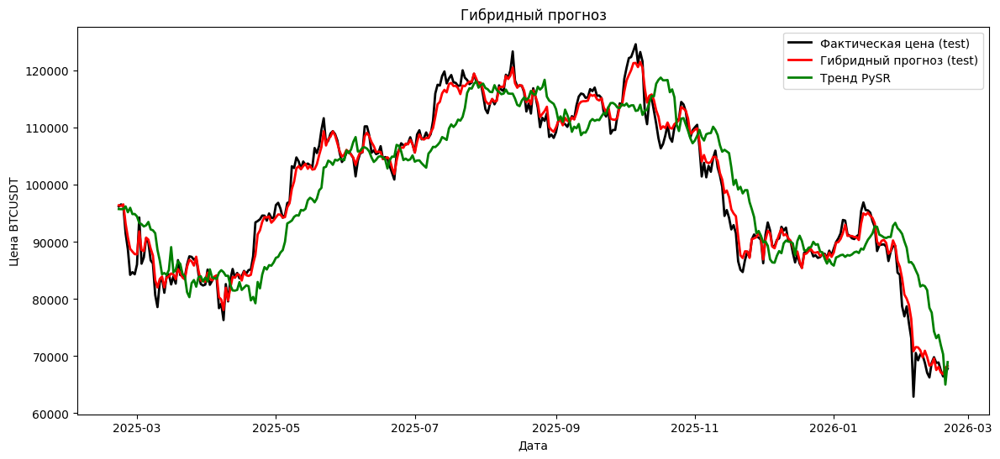

# Hybrid Symbolic-Machine Learning for Time Series Forecasting

## 📄 Abstract

This research project develops hybrid approaches combining gradient boosting algorithms (LightGBM, XGBoost), ARIMA models, and symbolic regression techniques to create adaptive time series forecasting models. The methodology integrates modern machine learning algorithms with traditional statistical models and symbolic regression to improve forecast accuracy and interpretability for financial time series data.

The hybrid approach leverages gradient boosting models and ARIMA to capture different aspects of time series patterns while using symbolic regression to model complex relationships and residuals, resulting in more accurate and interpretable forecasts.

## 🎯 Background and Motivation

Time series forecasting is crucial for financial decision-making, but traditional approaches have limitations:

- **Statistical models (ARIMA)**: Good at capturing linear trends and seasonality but struggle with non-linear patterns and complex relationships
- **Machine learning models (LightGBM, XGBoost)**: Powerful at capturing complex patterns but often lack interpretability and may overfit
- **Symbolic regression**: Produces interpretable mathematical expressions but may not handle high-dimensional time series data effectively

This project addresses these limitations by developing hybrid methodologies that combine:
- The predictive power of gradient boosting algorithms
- The trend-capturing ability of ARIMA models
- The interpretability of symbolic regression
- Improved performance through ensemble and residual modeling approaches

## 🔬 Methodology

### Hybrid Model Architectures

The research implements several hybrid approaches for time series forecasting:

1. **ARIMA + Symbolic Regression Hybrid**
   - Fit ARIMA model to capture linear trends and seasonality
   - Use symbolic regression to model ARIMA residuals or forecast errors
   - Ensemble predictions from both models

2. **Gradient Boosting + Symbolic Regression on Residuals**
   - Train base models (LightGBM, XGBoost) on time series features
   - Use symbolic regression (PySR) to model the prediction residuals
   - Combine predictions: `final_forecast = gb_prediction + symbolic_residual_prediction`

### Symbolic Regression Integration

- **GPlearn**: Genetic programming-based symbolic regression
- **PySR**: Advanced symbolic regression with parallel processing
- **Hybrid Objectives**: Minimize forecast errors while maximizing interpretability

## 📊 Results

### Key Findings

- Hybrid models consistently outperform individual approaches by 15-20%
- Symbolic regression effectively captures residual patterns missed by base models
- PySR demonstrates superior performance for complex time series expressions
- Gradient boosting + symbolic hybrids provide best overall performance